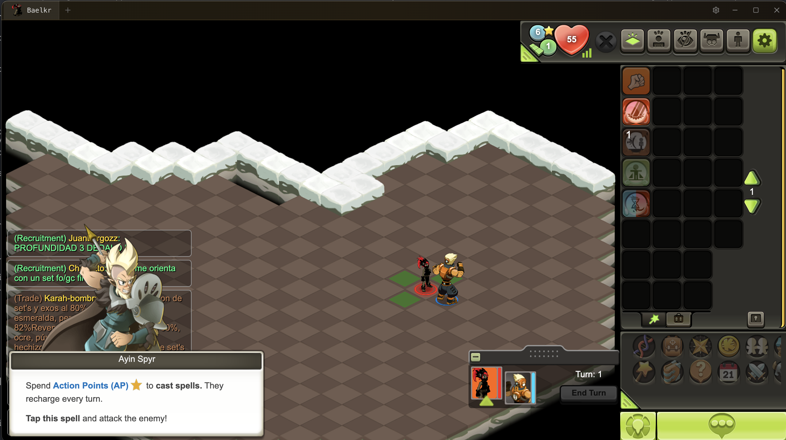

<p align="center">
  
</p>

<h1 align="center">Nememu</h1>


[](https://nodejs.org)

Unofficial desktop client for Dofus Touch.

> **Using a third-party client breaches Ankama's terms of service and can get an
> account sanctioned.** That risk is real and it belongs to whoever runs the
> client, so it is stated here rather than in a footnote. Nememu automates
> nothing on your behalf: it adds keyboard control to a touch client and leaves
> every decision in game to the player.



## Features

- Multi-account with up to 5 tabs
- Team management with leader/follower roles
- Auto-group — followers auto-follow across maps
- Auto-invite — automatic party invitations
- Drag-to-reorder tabs
- Character icon capture in tabs
- Configurable hotkeys, active inside the game window too, and readable on the
  physical key — the AZERTY top row prints `& é " '`, not digits
- Shortcuts cheat sheet, opened on first launch and one click away after
- Combat shortcuts — spell selection, end turn, ready
- Game windows by key — spells, quests, jobs, friends, guild
- Map travel with the arrow keys, walking to the edge the way a swipe does
- Chat opened with Enter
- Display shortcuts — tactical mode, interactive highlighting, player names,
  monster group info (held), battle grid, spell animations
- Optional FPS counter
- French and English interface
- Disconnect detection — the tab dims, a dot appears, a system notification fires
- A warning when the local port is taken, because the fallback port is what
  brings the emailed code back
- Startup failures explained in a sentence, with the raw error kept underneath
- A log file next to the settings, previous run kept, capped, repeats folded
- Fullscreen, remembered zoom, display sleep blocked while signed in
- Escape closes open game windows
- Reload a stuck tab without dropping the other accounts
- Activity dot on background tabs
- Confirmation before closing with several accounts signed in
- Window size and position remembered
- Saved accounts with OS-encrypted credentials
- Audio mute / sound-on-focus
- Proxy support (HTTP, HTTPS, SOCKS5) with authentication
- Auto-download and patch game files on startup
- Updates announced but never applied without a click
- Persistent settings via electron-store

## Download

Releases live at [github.com/Ewnaraa/nememu/releases](https://github.com/Ewnaraa/nememu/releases).
Each one carries the installer, its SHA256 and the command to check it.

The installer is **not signed** — a publisher certificate costs several hundred
euros a year — so Windows shows SmartScreen's "Windows protected your PC". That
warning is doing its job, and the honest answer to it is not "click through
anyway" but "check the file first":

```powershell
Get-FileHash "$HOME\Downloads\Nememu-Setup-<version>.exe" -Algorithm SHA256
```

If the hash matches the one on the release page, the file is the one that was
published. If it does not, do not run it.

You can also build it yourself (see **Build**): `pnpm run dist` produces a `.exe`
(NSIS) on Windows, a `.dmg` on macOS and an `.AppImage` on Linux.

## Development

```bash
pnpm install
pnpm run dev
```

## Tests

```bash
pnpm test
```

Downloads the live game build and checks that every regex patch still applies,
that the patched script stays valid, and that the game internals the client
drives — combat shortcuts, the window manager, auto-group messages — are still
present. Run it after an Ankama update: it is what turns a silently broken
shortcut into a failing test.

## Build

```bash
pnpm run build     # compile only
pnpm run dist      # build + package + zip, nothing is published
pnpm run release   # same, and uploads to GitHub — needs GH_TOKEN
```

`pnpm run dist` writes to `release/`: the installer, its `.blockmap`,
`latest.yml`, a `LISEZ-MOI.txt` whose SHA256 is filled in from the file that was
just built, a `NOTES.md` ready to paste into a GitHub release, and the zip to
hand to someone directly.

## Releasing

1. Bump `version` in `package.json` and add a matching `## x.y.z` section to
   `CHANGELOG.md` — the notes are generated from it, and a missing section is
   reported rather than silently skipped.
2. `pnpm test && pnpm run typecheck && pnpm run dist`.
3. Create the GitHub release and attach **all three** of
   `Nememu-Setup-x.y.z.exe`, its `.blockmap`, and `latest.yml`.
   Paste `release/NOTES.md` as the body.

Two things quietly break an otherwise correct release:

- **`latest.yml` is missing.** It is what the in-app updater reads. A release
  published without it is invisible to every copy already installed — the update
  button simply finds nothing, and says so as if there were nothing to find.
- **The installer's filename changed.** `latest.yml` names the asset it expects,
  and GitHub rewrites spaces in uploaded filenames (`A B.exe` becomes
  `A.B.exe`), which is enough to make the download 404 while everything else
  looks fine. `build.nsis.artifactName` therefore produces a name with no spaces
  in it, so what the manifest asks for and what GitHub serves are the same
  string however the file got there.

## App updates

The update feed is set **explicitly**, in two places that have to agree:
`UPDATE_FEED` in `packages/main/updater/app-updater.ts` and `build.publish` in
`package.json`. Both point at `Ewnaraa/nememu`.

It was not always so. `build.publish` used to carry the *upstream* project's
repository, inherited by copying the config — which left every distributed copy
one button away from replacing itself with a binary nobody here had read,
undoing the audit this fork exists for. Naming the feed in code, rather than
letting the packager decide, is what makes that mistake visible.

Nothing is downloaded or installed without an explicit click: `autoDownload` and
`autoInstallOnAppQuit` stay off, and an available update is announced while the
game starts normally. Setting `UPDATE_FEED` to `null` ships a build that never
contacts an update server at all.

## Stack

| Layer | Tech |
|-------|------|
| Shell | Electron |
| UI | React 19, TypeScript |
| Build | Vite |
| State | Zustand |
| Server | Hono |
| Storage | electron-store |

## Project Structure

```
packages/
  main/           Electron main process
    windows/      BrowserWindow management
    updater/      Game downloader + patcher
    game-base/    Game shell, CSS fixes, regex patches
    scripts/      Injected helper scripts
  renderer/       React frontend
    screens/      GameScreen, SetupScreen, SettingsScreen
    stores/       Zustand stores (tabs, teams, settings)
    mods/         Game mods (auto-group, party invite)
    components/   Shared components
    utils/        Utilities
  preload/        Electron preload bridge
  shared/         Shared types and constants
```

## Network & privacy

The client talks to exactly four places, and nowhere else:

| Destination | Why |
|---|---|
| `dt-proxy-production-login.ankama-games.com` | downloads and updates the Dofus Touch game files |
| `itunes.apple.com/lookup?id=1041406978` | reads the published app version number |
| `api.github.com` / `objects.githubusercontent.com` | checks for a Nememu release, and downloads one only when asked |
| `127.0.0.1` | the local static server that serves the game to the window |

Account tokens (HAAPI key, refresh token, certificates) are handled entirely
in the local game window so several accounts can be signed in at once. They
are never uploaded anywhere.

Notes for anyone auditing or forking this:

- The local game server uses a stable port (27615), so the game keeps the same
  origin across launches and its own session storage — including the Ankama
  device certificate — survives a restart. With a random port the certificate
  was orphaned every launch, which is what made Ankama email a new code each
  time.
- Combat and display shortcuts call the game's own UI methods, the same ones a
  tap calls. Selecting a spell selects it; aiming and confirming stay with the
  player.
- Zoom uses Chromium's own zoom rather than a CSS transform, so pointer
  positions cannot drift from what the game renders.
- The client does not re-expose the game's own settings. Options that already
  live in the game's menus or control bar stay there; what Nememu adds is
  keyboard control over them, which a touch client has none of.
- The update check is the only outbound call the client makes on its own behalf,
  it sends nothing but a version number, and it downloads nothing without a
  click. The feed is named in source (`UPDATE_FEED`) rather than inherited from
  the packager's config, so which repository a build will accept an update from
  is answerable by reading one line.
- The proxy applies to the game window's session. The game **downloader**
  connects directly — set a system-wide proxy if you need that traffic routed too.
- The proxy password is encrypted with the OS keychain (DPAPI / Keychain /
  libsecret) before being written to `nememu-data.json`. If the OS offers no
  encryption, the password is kept in memory only and not persisted.
- The local server binds to `127.0.0.1`, sends no CORS header, and refuses any
  path that resolves outside the directory it serves.
- The game window runs with `webSecurity: false` and `allowRunningInsecureContent`.
  Both are required: the Cordova-based game is served from the local origin while
  it calls Ankama's, and the shell reads the game iframe's document to drive
  multi-account features. `contextIsolation` and `nodeIntegration` keep their
  secure Electron defaults, and the preload exposes a fixed API surface only.
- Only HTTP failures are logged, with query strings stripped, so tokens never
  land in the console.

## License

GPL-3.0 — see [LICENSE](LICENSE).

Forked from [angine67/DofuEmu](https://github.com/angine67/DofuEmu), which is
GPL-3.0 too; the licence travels with the fork, which is why the full text is in
the repository rather than only named here.
